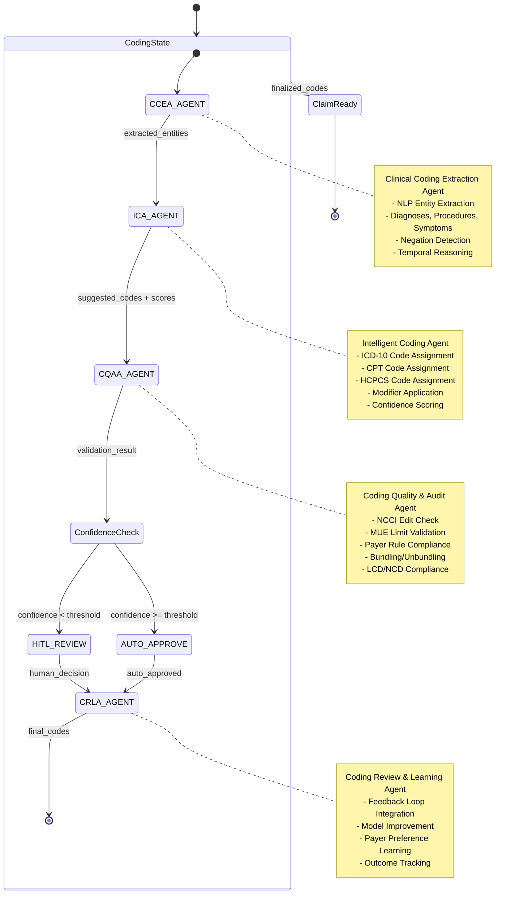
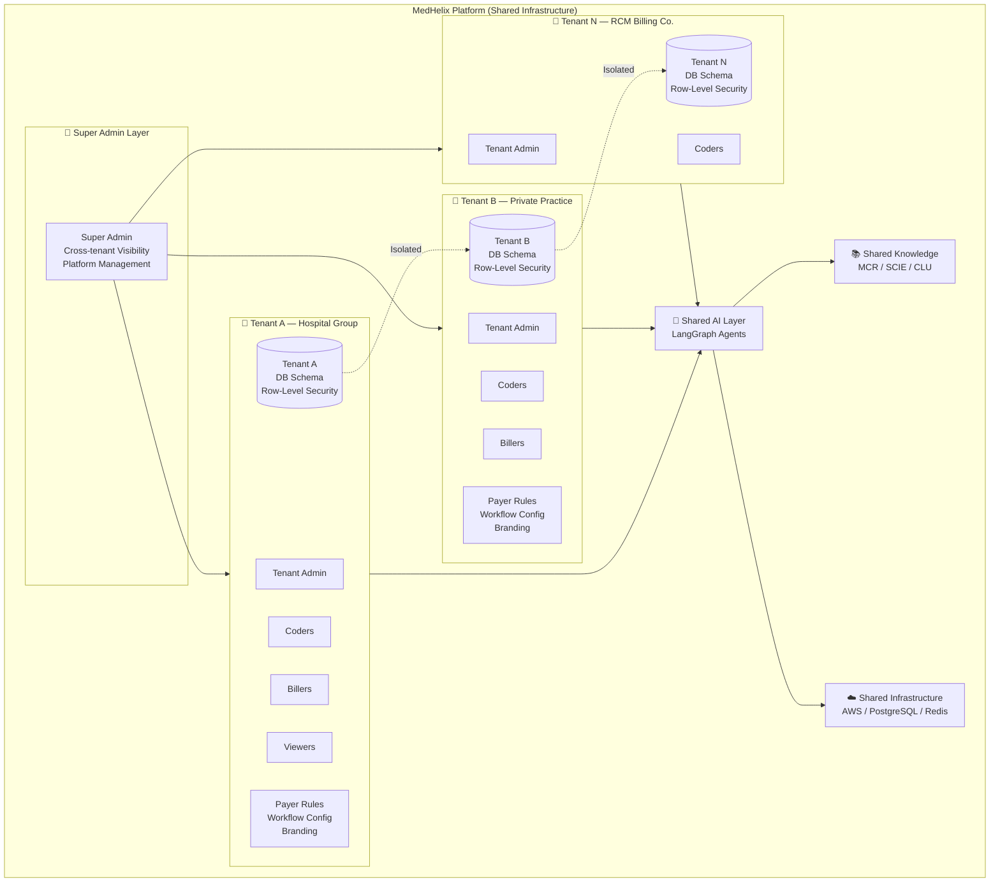
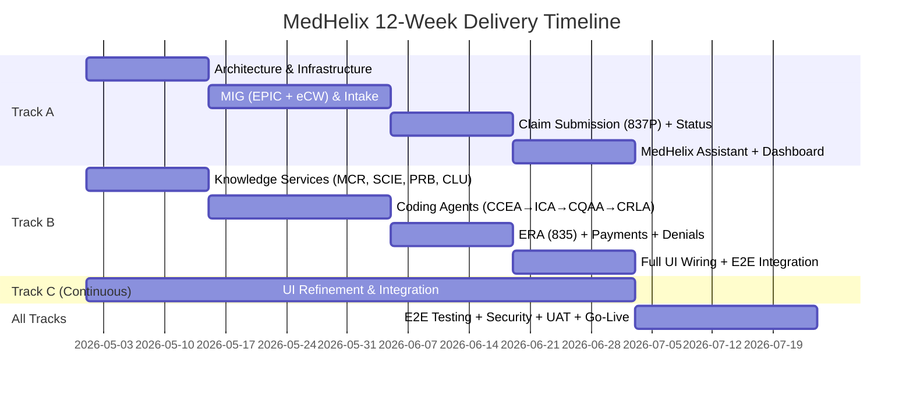
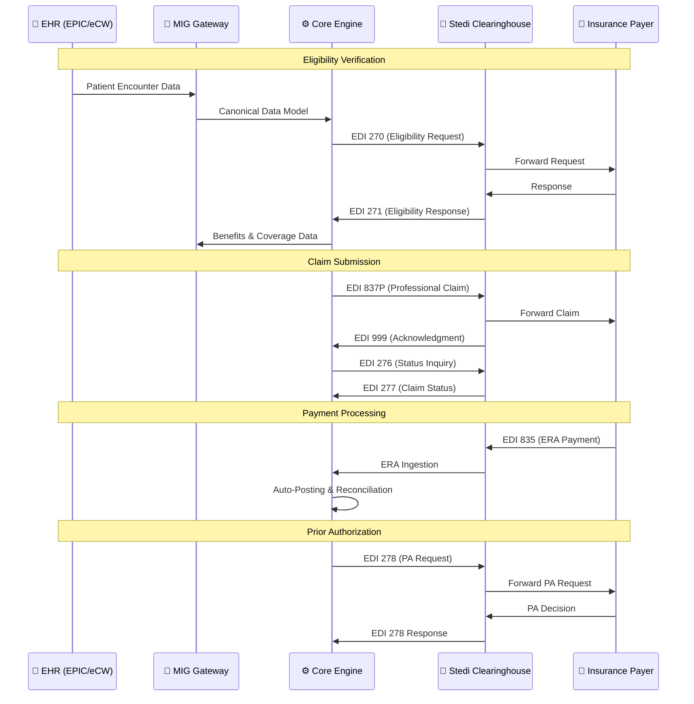

# MedHelix — Complete Architecture Diagrams

## 1. 🏗️ Overall System Architecture

```mermaid
graph TB
    subgraph CLIENT["🏥 Client Layer (React 18 + TypeScript + Tailwind)"]
        UI_DASH["📊 Dashboard"]
        UI_CODING["💻 Coding Workspace"]
        UI_CLAIMS["📋 Claims Worklist"]
        UI_APPEALS["⚖️ Appeals Workspace"]
        UI_PAYMENTS["💰 Payments Workspace"]
        UI_HITL["👤 HITL Queue"]
        UI_ELIG["✅ Eligibility Check"]
        UI_REPORT["📈 Reporting"]
        UI_ASSIST["🤖 MedHelix Assistant"]
        UI_SETTINGS["⚙️ Settings"]
    end

    subgraph GATEWAY["🔐 API Gateway (FastAPI + Auth0 + RBAC)"]
        AUTH["Auth0 SSO/MFA"]
        RBAC["Role-Based Access Control"]
        RATE["Rate Limiting & Routing"]
    end

    subgraph MIG["🔌 MedHelix Integration Gateway (MIG)"]
        EHR_EPIC["EPIC\n(FHIR R4 / HL7)"]
        EHR_ECW["eClinicalWorks\n(FHIR / HL7)"]
        STEDI["Stedi Clearinghouse\n(837P/835/270/271/276/277/278)"]
        CLAUDE["Anthropic Claude\n(LLM API)"]
        NLP["AWS Comprehend Medical\n(Clinical NLP)"]
    end

    subgraph CORE["⚙️ Core Functional Modules (Python FastAPI)"]
        INTAKE["Intake &\nPre-Processing"]
        ELIG_MOD["Eligibility\nVerification"]
        PRIOR_AUTH["Prior\nAuthorization"]
        CODING["Intelligent\nCoding Engine"]
        CLAIM_SUB["Claim\nSubmission"]
        CLAIM_STATUS["Claim Status\nTracking"]
        PAYMENT["Payment\n& Posting"]
        DENIALS["Denials\nManagement"]
        APPEALS["Appeals\nManagement"]
        HITL["HITL\nQueue"]
        REPORTING["Reporting\n& Analytics"]
    end

    subgraph AI["🤖 AI & Intelligence Layer (LangGraph + LangChain)"]
        MWO["MedHelix Workflow\nOrchestrator (MWO)"]
        CCEA["CCEA\nExtraction Agent"]
        ICA["ICA\nCoding Agent"]
        CQAA["CQAA\nQuality Agent"]
        CRLA["CRLA\nLearning Agent"]
        ASSIST_AI["MedHelix\nAssistant AI"]
        PRB["Payer Rules\nBrain (PRB)"]
    end

    subgraph KNOWLEDGE["📚 Knowledge Services"]
        MCR["MCR\nMaster Code Repository\nICD-10 / CPT / HCPCS"]
        SCIE["SCIE\nSpecialty Compliance\nIntelligence Engine"]
        CLU["CLU\nClinical Language\nUnderstanding"]
    end

    subgraph INFRA["☁️ Infrastructure (AWS)"]
        PG["PostgreSQL 15+\nRow-Level Security\nMulti-Tenant"]
        REDIS["Redis Cache"]
        KAFKA["Kafka / RabbitMQ\nEvent Queue"]
        S3["AWS S3\nDocument Storage"]
        SECRETS["AWS Secrets\nManager"]
        EATS["EATS\nAudit Trail\nSystem"]
    end

    CLIENT --> GATEWAY
    GATEWAY --> CORE
    GATEWAY --> AI
    CORE --> MIG
    CORE --> AI
    CORE --> KNOWLEDGE
    CORE --> INFRA
    AI --> KNOWLEDGE
    AI --> INFRA
    MIG --> INFRA
```

---

## 2. 🔄 End-to-End RCM Claim Workflow

```mermaid
flowchart TD
    START([🏥 Patient Encounter]) --> INTAKE_NODE

    subgraph INTAKE_GRP["📥 Phase 1: Intake & Pre-Processing"]
        INTAKE_NODE["Encounter Ingestion\nEHR Data Pull\nEPIC / eClinicalWorks"] --> DEMO_VAL["Demographics\nValidation"]
        DEMO_VAL --> INS_DISC["Insurance\nDiscovery"]
        INS_DISC --> DOC_ING["Document\nIngestion"]
    end

    subgraph ELIG_GRP["✅ Phase 2: Eligibility Verification"]
        ELIG_CHECK["Real-time Eligibility\nEDI 270 Request"] --> ELIG_RESP["EDI 271 Response\nBenefits Display"]
        ELIG_RESP --> COV_VAL["Coverage\nValidation"]
    end

    subgraph PA_GRP["🔐 Phase 3: Prior Authorization"]
        PA_CHECK{"PA\nRequired?"} -->|Yes| PA_SUB["EDI 278\nSubmission"]
        PA_SUB --> PA_STATUS["PA Status\nTracking"]
        PA_CHECK -->|No| CODING_GRP
    end

    subgraph CODING_GRP["🧠 Phase 4: AI Intelligent Coding"]
        CCEA_NODE["CCEA Agent\nClinical Entity\nExtraction"] --> ICA_NODE["ICA Agent\nAI Code\nAssignment\nICD-10 / CPT"]
        ICA_NODE --> CQAA_NODE["CQAA Agent\nCoding Quality\n& Audit"]
        CQAA_NODE --> HITL_CHECK{"Confidence\nThreshold?"}
        HITL_CHECK -->|Low| HITL_NODE["HITL Queue\nHuman Review"]
        HITL_NODE --> CRLA_NODE["CRLA Agent\nLearning &\nFeedback Loop"]
        HITL_CHECK -->|High| CRLA_NODE
    end

    subgraph CLAIM_GRP["📋 Phase 5: Claim Submission"]
        PRB_NODE["Payer Rules Brain\nValidation\n+ Scrubbing"] --> EDI_837["837P Generation\nClaim Build"]
        EDI_837 --> STEDI_SUB["Stedi Clearinghouse\nSubmission"]
        STEDI_SUB --> ACK["Acknowledgment\nTracking"]
    end

    subgraph STATUS_GRP["📡 Phase 6: Claim Status"]
        EDI_276["EDI 276\nStatus Inquiry"] --> EDI_277["EDI 277\nStatus Response"]
        EDI_277 --> STATUS_DASH["Status Dashboard\n& Alerts"]
    end

    subgraph PAYMENT_GRP["💰 Phase 7: Payment & Posting"]
        ERA_835["ERA (835)\nIngestion"] --> AUTO_POST["Auto-Posting\nEngine"]
        AUTO_POST --> RECON["Reconciliation\n& Adjustments"]
        RECON --> EOB_PROC["EOB\nProcessing"]
    end

    subgraph DENIAL_GRP["🚫 Phase 8: Denials Management"]
        DENIAL_ING["Denial\nIngestion"] --> CARC_PARSE["CARC / RARC\nParsing"]
        CARC_PARSE --> ROOT_CAUSE["Root Cause\nAnalysis"]
        ROOT_CAUSE --> DENIAL_CAT["Denial\nCategorization"]
    end

    subgraph APPEALS_GRP["⚖️ Phase 9: Appeals Management"]
        APPEAL_GEN["AI Appeal Letter\nGeneration (Claude)"] --> APPEAL_SUB["Appeal\nSubmission"]
        APPEAL_SUB --> APPEAL_TRACK["Outcome\nTracking"]
    end

    DOC_ING --> ELIG_CHECK
    COV_VAL --> PA_CHECK
    PA_STATUS --> CODING_GRP
    CRLA_NODE --> PRB_NODE
    ACK --> EDI_276
    RECON --> DENIAL_CHECK{"Denied?"}
    DENIAL_CHECK -->|Yes| DENIAL_ING
    DENIAL_CHECK -->|No| SUCCESS([✅ Payment Complete])
    DENIAL_CAT --> APPEAL_CHECK{"Appeal\nWorthy?"}
    APPEAL_CHECK -->|Yes| APPEAL_GEN
    APPEAL_CHECK -->|No| WRITEOFF([📝 Write-off / AR])
    APPEAL_TRACK --> SUCCESS
```

---

## 3. 🤖 AI Coding Agents Pipeline (LangGraph)

---

## 4. 🏢 Multi-Tenant Architecture

---

## 5. 📦 Module Dependency & Delivery Phases

---

## 6. 🔌 EDI Transaction Flow (Clearinghouse)

